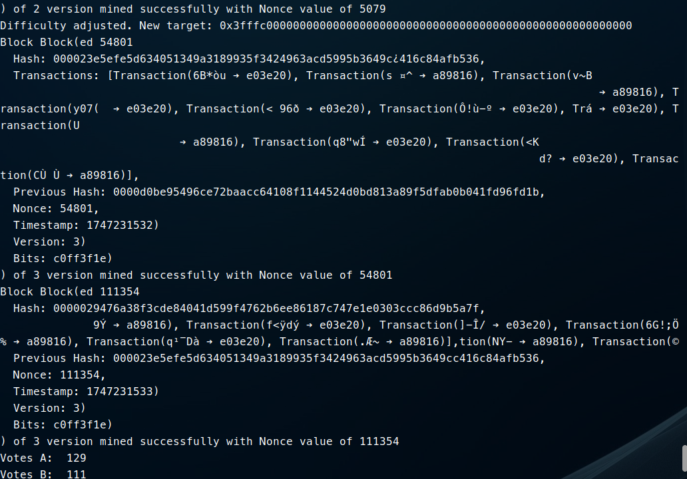

# 🗳️ Blockchain-Based Voting System Simulation

A Python-based simulation of a secure, anonymous, and verifiable voting system using **commutative asymmetric encryption** and a **blockchain-like ledger**. This system enables voters to **cast anonymized votes**, **verify their own votes**, and **tally the results** in a transparent yet private way.

> 🔐 Inspired by the **SRA Mental Poker** protocol and the **Massey-Omura Cryptosystem**.

---

## 🚀 Features

- ✅ **Anonymous Voting** – Cast encrypted votes while preserving voter privacy.
- 🔐 **Commutative Asymmetric Encryption** – Enables encryption/decryption in any order without compromising results.
- 🔎 **Vote Verification** – Each voter can verify that their vote is included in the ledger.
- 📊 **Secure Vote Counting** – Votes are decrypted and tallied securely.
- ⛓️ **Blockchain Simulation** – Each vote is a block in a linked chain to ensure transparency and immutability.

---
## Massey Omura Cryptosystem
Ref:
- [Buchanan, William J (2025)](https://asecuritysite.com/commul/massey2)

---
## Mental Poker Protocol
The Mental Poker protocol by Shamir, Rivest, and Adleman (SRA) allows two or more players to "play" a fair card game without trusting each other, using commutative encryption. In the context of voting, we use this approach to shuffle, encrypt, and anonymously process ballots.

Key Concepts
Every participant has their own commutative public-private key pair: 
(
𝑒
𝑖
,
𝑑
𝑖
)
(e 
i
​
 ,d 
i
​
 )

Messages (e.g., votes or cards) are encrypted multiple times, once per participant

Decryption occurs in reverse order of encryption, revealing the original message securely

Example Flow
Let the message (vote/card) be 
𝑀
M

Alice encrypts using her key 
𝑒
𝑎
e 
a
​
 :

𝐶
1
=
𝐸
(
𝑒
𝑎
,
𝑀
)
C 
1
​
 =E(e 
a
​
 ,M)
Bob further encrypts using his key 
𝑒
𝑏
e 
b
​
 :

𝐶
2
=
𝐸
(
𝑒
𝑏
,
𝐶
1
)
=
𝐸
(
𝑒
𝑏
,
𝐸
(
𝑒
𝑎
,
𝑀
)
)
C 
2
​
 =E(e 
b
​
 ,C 
1
​
 )=E(e 
b
​
 ,E(e 
a
​
 ,M))
Now Bob decrypts with 
𝑑
𝑏
d 
b
​
 :

𝐶
3
=
𝐷
(
𝑑
𝑏
,
𝐶
2
)
=
𝐷
(
𝑑
𝑏
,
𝐸
(
𝑒
𝑏
,
𝐸
(
𝑒
𝑎
,
𝑀
)
)
)
=
𝐸
(
𝑒
𝑎
,
𝑀
)
C 
3
​
 =D(d 
b
​
 ,C 
2
​
 )=D(d 
b
​
 ,E(e 
b
​
 ,E(e 
a
​
 ,M)))=E(e 
a
​
 ,M)
Finally, Alice decrypts with 
𝑑
𝑎
d 
a
​
 :

𝑀
=
𝐷
(
𝑑
𝑎
,
𝐶
3
)
=
𝐷
(
𝑑
𝑎
,
𝐸
(
𝑒
𝑎
,
𝑀
)
)
M=D(d 
a
​
 ,C 
3
​
 )=D(d 
a
​
 ,E(e 
a
​
 ,M))
✅ Properties
Privacy: No single party knows the full vote before collaborative decryption

Fairness: All parties apply and remove encryption without learning the vote

Commutativity: Order of encryption and decryption doesn't affect correctness

🗳️ Why Use This in Voting?
This protocol ensures that:

Voters don't trust a central authority

Ballots are shuffled and anonymized

Anyone can verify that their vote was included and not altered

🔐 Combined with Massey–Omura
When combined with the Massey–Omura cryptosystem, this approach forms the backbone of secure, anonymous, verifiable voting simulations—like the one implemented in this project.

📖 Further Reading
SRA Mental Poker Paper (1979)

Massey–Omura Cryptosystem

---

## 🛠️ Technologies Used

Python  
Cryptographic principles from:
  - [Mental Poker (SRA Protocol)](https://en.wikipedia.org/wiki/Mental_poker)
  - [Massey-Omura](https://asecuritysite.com/commul/massey2)

---

## 📦 Installation & Usage

    # 1. Clone the repository
    git clone https://github.com/getintogit1/BBVS-Simulation.git
    cd BBVS-Simulation

    # 2. Install Dependencies
    pip install -r requirements.txt

    # 3. Run main.py
    python main.py 

---

## Example
The following screenshot shows a simulation run with 240 voters and 2 candidates (A and B). The blockchain records each vote as a transaction, grouped into mined blocks with unique hashes.

🔍 What's Visible:

Each mined block displays:

Block ID

Hash and Previous Hash

Nonce used for proof-of-work

Timestamp, Version, and Difficulty Bits

A list of encrypted transactions (votes)
The Target value (mining difficulty) gets dynamically adjusted similiar to Bitcoin.

🔄 Encrypted Transactions:

Each vote is stored as a transaction in the blockchain using commutative encryption

Transaction entries reflect anonymized sender/receiver values

🧮 Final Vote Count:

Candidate A received: 129 votes

Candidate B received: 111 votes

Notes:
Even though transactions look obfuscated, voters can verify their individual votes through the encryption chain.

This demonstrates a fully simulated, decentralized, and verifiable voting process using the Massey–Omura encryption technique and mental poker principles.

